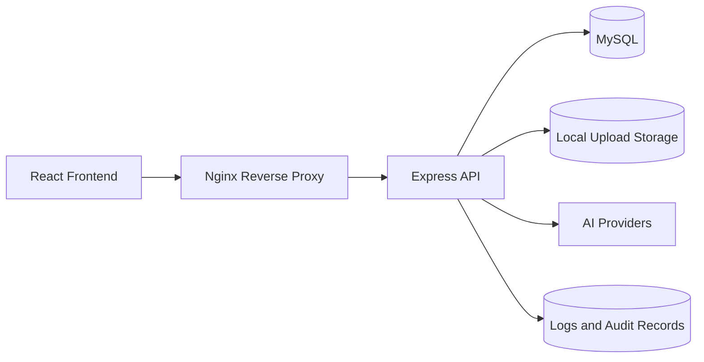

# AI Smart Learning Management System

AI Smart LMS is an enterprise-ready Learning Management System for DBIT that combines role-based academic workflows, AI-assisted quiz generation, file management, reporting, notifications, search, security monitoring, backups, and production deployment support.

## Features

- Role-based dashboards for Super Admin, Admin, Teacher, and Student.
- JWT authentication, RBAC, granular permissions, audit logs, and account lockout.
- Curriculum, materials, files, announcements, notifications, quiz, and reports modules.
- AI question generation with provider abstraction, validation, duplicate detection, retry support, and cost/usage monitoring.
- File uploads with versioning, previews, downloads, storage statistics, and validation.
- Enterprise security dashboard, backup/restore metadata, performance dashboard, health APIs, and deployment assets.
- React route-level code splitting, reusable UI components, API caching, ETag headers, and performance metrics.

## Technology Stack

- Frontend: React 19, Vite, Tailwind CSS, React Router, Axios, Recharts, React Testing Library.
- Backend: Node.js, Express, MySQL, JWT, Express Validator, Multer, Helmet, Compression.
- Testing: Jest, Supertest, Playwright.
- DevOps: Docker, Docker Compose, Nginx, PM2, GitHub Actions-ready CI, Prometheus-ready health config.

## System Architecture



## Folder Structure

```text
lms/
  backend/          Express API, services, routes, validators, database schema
  frontend/         React client, routes, pages, components, services
  docs/             Architecture, API, user, admin, developer, and deployment guides
  nginx/            Reverse proxy configuration
  deploy/           Deployment and backup scripts
  monitoring/       Prometheus-ready configuration
  tests/e2e/        Playwright end-to-end tests
```

## Installation

```bash
npm ci
cp backend/.env.example backend/.env
```

Configure MySQL and update `backend/.env`.

## Running Locally

Backend:

```bash
npm run dev:backend
```

Frontend:

```bash
npm run dev:frontend
```

Default URLs:

- Frontend: `http://localhost:5173`
- Backend: `http://localhost:5000`
- Health: `http://localhost:5000/health`

## Environment Variables

Use `.env.development.example`, `.env.staging.example`, `.env.production.example`, or `backend/.env.example` as templates. Never commit real secrets.

Key variables:

- `JWT_SECRET`
- `DB_HOST`, `DB_PORT`, `DB_NAME`, `DB_USER`, `DB_PASSWORD`
- `CLIENT_URL`
- `AI_PROVIDER`, provider keys, and model names
- `STORAGE_PROVIDER`, `STORAGE_LOCAL_BASE_URL`
- `API_RATE_LIMIT_MAX`, `CACHE_PROVIDER`

## Docker

Development:

```bash
cp .env.development.example .env.development
docker compose -f docker-compose.dev.yml up
```

Production:

```bash
cp .env.production.example .env.production
docker compose -f docker-compose.prod.yml up -d --build
```

## Testing

```bash
npm test
npm run test:coverage
npm run test:e2e
```

See [TESTING.md](TESTING.md).

## Production Deployment

Deployment assets include Dockerfiles, Docker Compose, Nginx, PM2, health APIs, backup scripts, CI workflow, and documentation. See [docs/DEPLOYMENT.md](docs/DEPLOYMENT.md).

## API Documentation

OpenAPI specification: [docs/api/openapi.yaml](docs/api/openapi.yaml)

API guide: [docs/API.md](docs/API.md)

## Screenshots

Screenshots can be added under `docs/assets/screenshots/` for:

- Super Admin dashboard
- Teacher dashboard
- Student quiz workflow
- Security dashboard
- Performance dashboard

## Contributors

- DBIT LMS project team
- Maintainers and future contributors

## License

Private project. Add an organization-approved license before public distribution.

## Future Improvements

- Redis-backed sessions and cache.
- External object storage such as S3, Azure Blob, or Cloudinary.
- Background queue workers for AI, reports, notifications, backups, and video processing.
- OpenTelemetry exporters and Prometheus metrics endpoint.
- Cloud-specific deployment templates.
