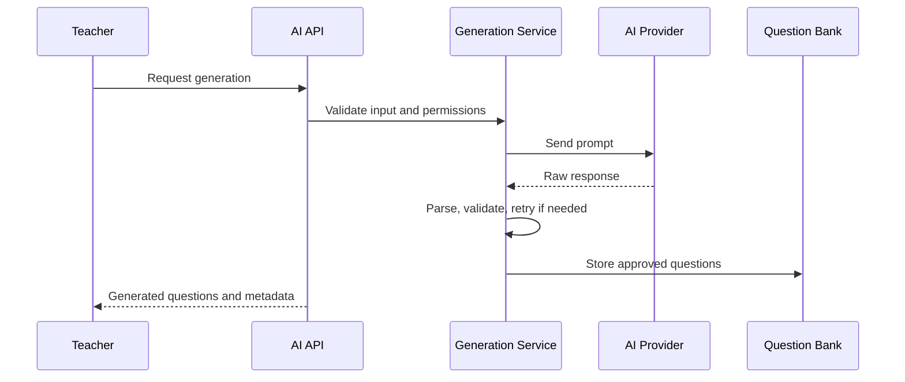

# AI Module Documentation

## Provider Architecture

The AI module uses provider abstraction under `backend/services/ai/providers`. This keeps OpenAI, Gemini, Ollama, and local providers replaceable without changing controller or route behavior.

## Configuration

Important environment variables:

- `AI_PROVIDER`
- `OPENAI_API_KEY`, `OPENAI_MODEL`
- `GEMINI_API_KEY`, `GEMINI_MODEL`
- `OLLAMA_BASE_URL`, `OLLAMA_MODEL`
- `AI_TIMEOUT`
- `AI_MAX_RETRIES`
- `AI_BATCH_SIZE`
- `MAX_TOKENS`
- `TEMPERATURE`

## Question Generation Flow

## Prompt Builder

Prompt templates define structured instructions for MCQ generation, difficulty, topic, category, answer options, correct answer, and explanations.

## Duplicate Detection

Duplicate detection compares generated content against existing question bank entries to reduce repeated questions and preserve assessment quality.

## Validation

Validation checks ensure:

- Required question fields exist.
- Exactly one correct answer is selected.
- Options are structured.
- Topic/category/difficulty are acceptable.

## Retry Logic

AI retry service handles transient provider failures and invalid responses within configured retry limits.

## Cost Monitoring

AI logs and cost endpoints expose request metadata for monitoring usage. External provider cost accounting can be expanded without changing API contracts.
