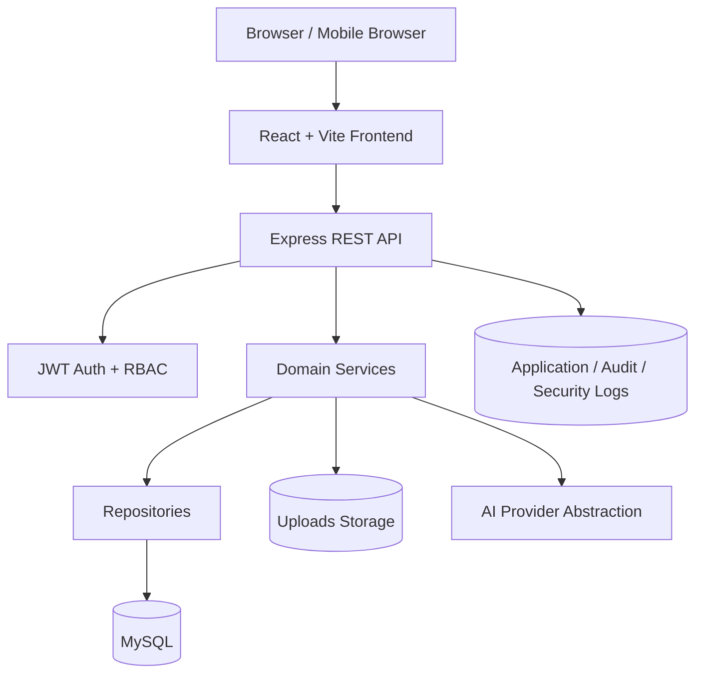
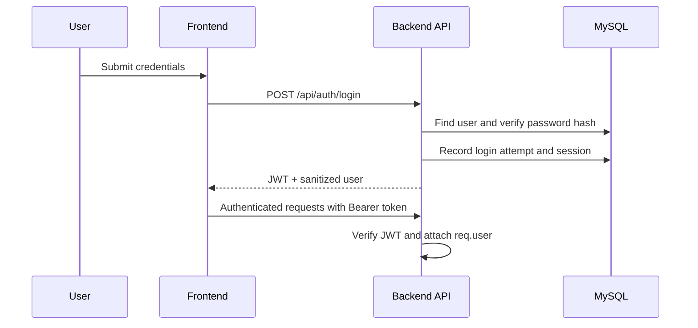
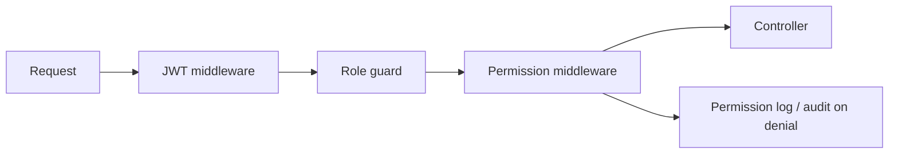
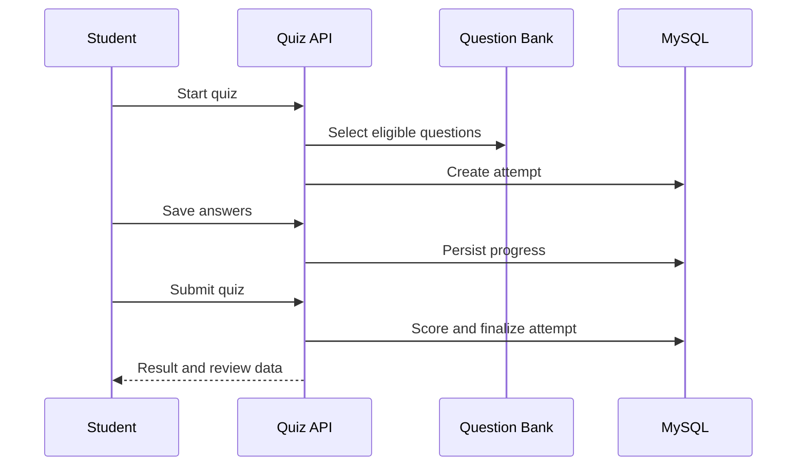
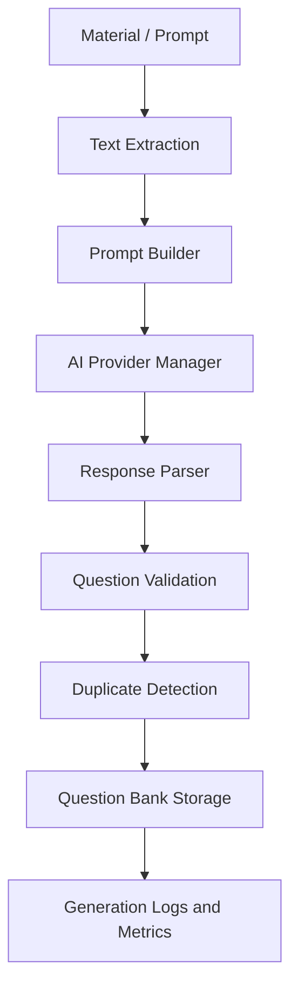
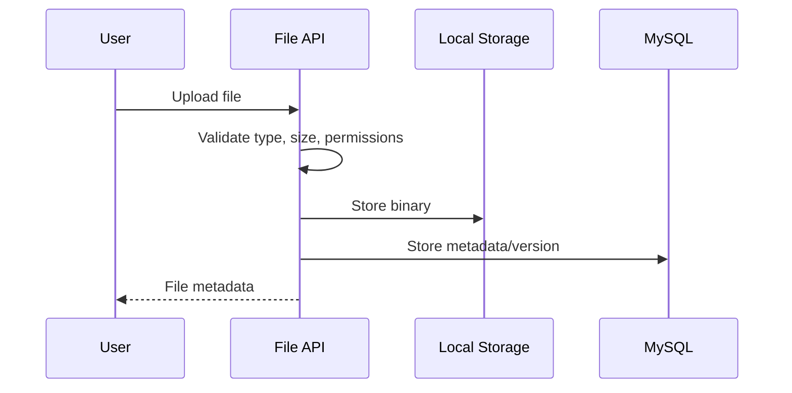
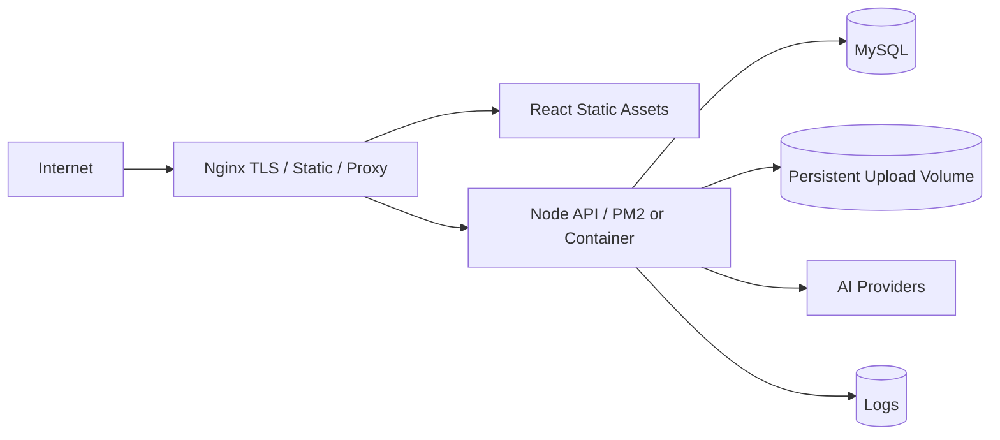

# Architecture Documentation

## System Architecture

## Frontend Architecture

- `src/routes`: route definitions with `React.lazy` and `Suspense`.
- `src/layouts`: public and dashboard layouts.
- `src/pages`: role and module-specific screens.
- `src/components`: reusable UI, navigation, auth, teacher, and super-admin components.
- `src/services`: Axios-based API clients.
- `src/hooks`: reusable data, auth, debounce, and virtualization hooks.
- `src/context`: authentication and shared UI state.

## Backend Architecture

- `routes`: REST route definitions and middleware composition.
- `controllers`: HTTP request handling and response formatting.
- `services`: business orchestration and domain logic.
- `repositories` / `models`: MySQL persistence boundaries.
- `validators`: request validation with Express Validator.
- `middleware`: authentication, RBAC, rate limiting, performance, errors, and logging.
- `utils`: response, JWT, password, pagination, file, and formatting helpers.

## Database Architecture

MySQL is the transactional source of truth. Schema files and migrations define users, sessions, curriculum, materials, AI question banks, files, notifications, reports, audit logs, backups, restores, and system health records.

## Authentication Flow

## Authorization Flow

## Quiz Flow

## AI Processing Flow

## File Upload Flow

## Report Generation Flow

Reports are served by report services that query optimized repository methods, format dashboard/export payloads, and return CSV/PDF/Excel-ready structures through standardized responses.

## Notification Flow

Announcements and notifications are created by authorized users or system services, stored in MySQL, filtered by recipient role/user, and displayed in notification center pages.

## Deployment Architecture

