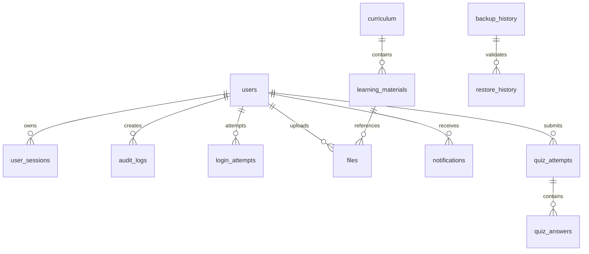

# Database Documentation

## Overview

The LMS uses MySQL with a normalized relational schema. The canonical schema is maintained in `backend/database/schema.sql`; incremental changes live under `backend/database/migrations`.

## Major Table Groups

- Identity: `users`, `user_sessions`, profile and preference tables.
- Academic: curriculum, subjects, topics, materials, completed topics.
- AI and quizzes: question bank, generation logs, quiz attempts, quiz answers.
- Files: uploaded file metadata, versions, storage and preview records.
- Communications: notifications, announcements, notification preferences.
- Reporting and search: report-related tables, search history, saved searches, analytics cache.
- Security and operations: `audit_logs`, `security_alerts`, `login_attempts`, `permission_logs`, `backup_history`, `restore_history`, `system_health`.

## Relationships

## Keys and Constraints

- Primary keys are numeric `id` columns.
- Public identifiers use `uuid` where available.
- Foreign keys link child records to users, backups, curriculum, files, and quiz records.
- Status fields use enums or constrained string values where defined in schema.

## Index Strategy

Indexes support:

- Authentication lookups by username/email.
- Audit and security filters by user, role, module, action, status, and date.
- File and material listing by owner, status, type, and timestamps.
- Search and analytics queries.
- Quiz history and reporting queries.

## Migration Strategy

1. Back up database.
2. Review SQL migration files.
3. Apply migrations in timestamp order.
4. Verify health endpoint and smoke-test critical workflows.
5. Record deployment notes in changelog.

## Backup Strategy

Backups include:

- MySQL dump.
- Uploaded files archive.
- Configuration archive.
- Backup metadata in `backup_history`.
- Restore validation metadata in `restore_history`.

Use `deploy/backup.sh` for operational backup preparation.
